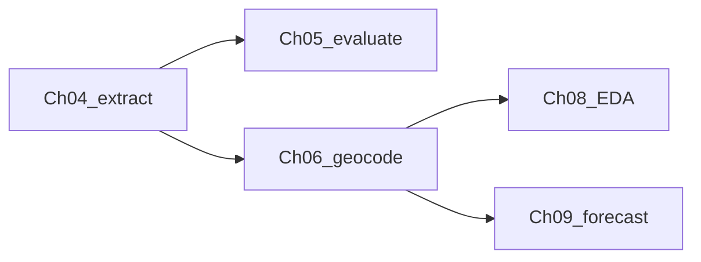

# Impact-Based-Drought-Forecasting-in-the-Netherlands-Using-LLM-Extracted-News-Data

Code and resources accompanying an MSc thesis on impact-based drought forecasting using LLM-extracted news data, developed to ensure transparent and reproducible results.

## Quick orientation

This repo is the **code + frozen artefacts** companion to the thesis write-up under `Thesis hand-in/` (LaTeX source; separate from the pipeline).

| Goal | Where to look |
| --- | --- |
| Verify the hand-in package | `python reproducibility_and_robustness_testing/run_all_scripts.py` |
| Data sources / what is shipped | [`DATA.md`](DATA.md) |
| Frozen Ch05 tables / figures | `chapters/05_llm_evaluation/results/` |
| Thesis-final geocoded points / NUTS-3 | `chapters/06_geocoding/data/final/` |
| Frozen Ch08 EDA figures / tables | `chapters/08_exploratory_data_analysis/results/` |
| Frozen Ch09 AutoML metrics | `chapters/09_baseline_forecasting/results/automl_results/` |

Pipeline (data flow between chapters):



## Repository structure

```text
.
├── README.md
├── .gitignore
├── DATA.md                            # data overview / hand-in catalogue
├── requirements.txt
├── chapters/
│   ├── 04_database_construction/      # Lexis → preprocess → LLMn
│   ├── 05_llm_evaluation/             # frozen eval metrics + report notebook
│   ├── 06_geocoding/                  # Nominatim points + NUTS-3 + viewer/EDA
│   ├── 08_exploratory_data_analysis/  # report EDA figures + tables
│   └── 09_baseline_forecasting/       # NUTS-3 AutoML forecasting
├── reproducibility_and_robustness_testing/
│   ├── check_imports.py
│   ├── run_all_scripts.py             # PASS / SKIPPED / FAIL summary
│   ├── chapter_04_database_construction/
│   ├── chapter_05_llm_evaluation/
│   ├── chapter_06_geocoding/
│   ├── chapter_08_exploratory_data_analysis/
│   └── chapter_09_baseline_forecasting/
└── Thesis hand-in/                    # thesis write-up (separate from code)
```

## Environment setup

```text
# create (first time)
python -m venv .venv

# activate (Windows PowerShell)
.\.venv\Scripts\Activate.ps1

# install or refresh dependencies after editing requirements.txt
python -m pip install -U pip
pip install -r requirements.txt

playwright install chromium   # once, after playwright is added

# automated procedure checks (imports → ch05 → ch06 → ch04; optional blank API key = skip)
python reproducibility_and_robustness_testing/run_all_scripts.py
```

`requirements.txt` covers Chapters 04–09 stacks (Playwright/LiteLLM, pandas/matplotlib/streamlit/geopandas, plus seaborn/networkx for Ch08 and scikit-learn/optuna/shap/xgboost/rasterio/pyarrow for Ch09).

## Chapter 04 (database construction)

Acquires LexisNexis article ZIPs, cleans and deduplicates them, then extracts structured drought impacts with a fixed schema via LiteLLM (multi-provider, batch-capable).

Details: [`chapters/04_database_construction/README.md`](chapters/04_database_construction/README.md).

```text
python chapters/04_database_construction/04_2_automated_data_acquisition/lexis_nexis_scraper.py
python chapters/04_database_construction/04_3_LLM_Input_Preprocessing/clean_archive.py
python chapters/04_database_construction/04_4_LLMn_Extraction_Framework/llmn_extraction.py
```

## Chapter 05 (LLM evaluation)

Frozen annotations and metrics under [`chapters/05_llm_evaluation/`](chapters/05_llm_evaluation/README.md). Run `notebooks/report_chapter5.ipynb` to regenerate thesis tables/figures (no article bodies or API keys).

## Chapter 06 (geocoding)

Point geocoding (Nominatim) + NUTS-3 assignment, Streamlit viewer, and wildfire EDA under [`chapters/06_geocoding/`](chapters/06_geocoding/README.md). Frozen `data/final/` CSVs support offline viewing without re-running Nominatim.

```text
cd chapters/06_geocoding
python src/point_coder.py
python src/nuts3_coder.py
streamlit run src/combined_viewer.py
```

## Chapter 08 (exploratory data analysis)

Report figures and Overleaf summary tables under [`chapters/08_exploratory_data_analysis/`](chapters/08_exploratory_data_analysis/README.md). Run `notebooks/01_report_final_figures.ipynb` (current-month NUTS-3 impacts, 2005–2025).

## Chapter 09 (baseline forecasting)

NUTS-3 multi-label AutoML under [`chapters/09_baseline_forecasting/`](chapters/09_baseline_forecasting/README.md). Notebooks `00`–`03` + `src/run_automl.py`; frozen metrics in `results/automl_results/`. Large DEM/BRO/CLC rasters are kept **locally** for rebuilds but gitignored (see that README).

## Reproducibility notes

- Full Lexis news corpora **cannot be redistributed** (copyright). The repo ships code, fixtures, and frozen evaluation/geocoding outputs—not the full thesis corpus.
- Chapter 04 **acquisition procedure** and **preprocessing** are reproducible as code; full downloads need Lexis credentials.
- **LLMn outputs** depend on third-party APIs; exact extractions are hard to bit-reproduce. Leave the Chapter 04 suite API prompt blank to **skip** the live call without failing the suite.
- Chapter 06 **NUTS-3 / viewer** paths are offline-reproducible from frozen files; **Nominatim** may change over time.
- Chapters 08–09 ship frozen figures/metrics; full Ch09 static rebuilds need local gitignored rasters under `09_baseline_forecasting/data/`.

Procedure checks: [`reproducibility_and_robustness_testing/README.md`](reproducibility_and_robustness_testing/README.md).
